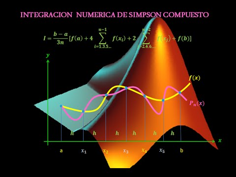

<h1 align="center">Curso de Métodos Numéricos</h1>


<div align="center">
    
</div><br>

## ***¡Bienvenido al curso de Métodos Numéricos!***

Este repositorio contiene una colección de algoritmos y ejemplos de implementación de diferentes métodos numéricos. Estos métodos son herramientas poderosas para resolver problemas matemáticos complejos y aproximaciones numéricas.

## Contenido

1. Métodos de Integración:
   - Método de Simpson Simple
   - Método de Romberg de Orden 4
   - Método de Riemann
   - Método del Trapecio Compuesto

2. Interpolación:
   - Interpolación Polinómica
   - Spline Cúbico Natural

3. Resolución de Matrices Tridiagonales:
   - Método de Thomas

4. Sistemas de Ecuaciones Diferenciales:
   - Método de Runge-Kutta de Cuarto Orden

## Uso

Cada carpeta dentro de este repositorio contiene el código fuente y ejemplos de uso de los diferentes métodos numéricos. Puedes explorar cada carpeta para acceder a la implementación específica y ver ejemplos de cómo utilizarlos en diferentes situaciones.

## Requisitos

- MATLAB 2021a o superior
- Bibliotecas adicionales (consulte los archivos `requirements.txt` en cada carpeta para obtener información específica)

## Instrucciones de Uso

1. Clona este repositorio en tu máquina local utilizando el siguiente comando:

   ```shell
   git clone github.com/OmarUTEC/Numerical-Methods.git
   ```
2. Navega a la carpeta del método numérico que deseas utilizar. Por ejemplo, para el método de Simpson Simple:

    ```shell
    cd numerical-methods/simpson-simple
    ```

# Contribuciones

Si deseas contribuir a este repositorio, eres bienvenido(a) a hacerlo.


# ¡Diviértete explorando y aplicando estos métodos numéricos en tus propios proyectos!

<div align="center">
    
</div>

## Autor

 - [**Om@r**](https://github.com/OmarUTEC)
